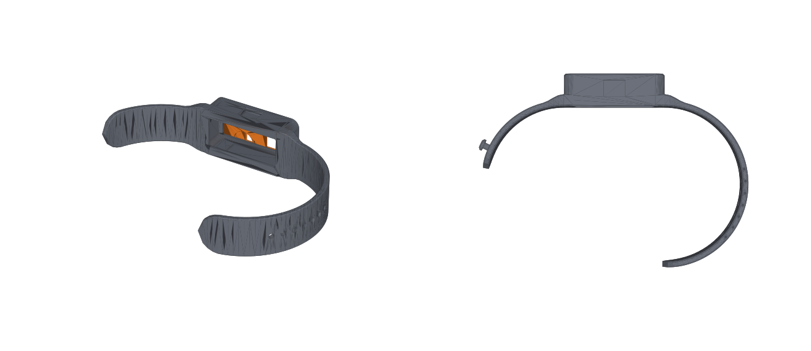

# StickS3 run display

A wrist display that shows two numbers while running: **heart rate** from a Bluetooth chest strap, and **pace** from the phone's GPS. Built on an [M5Stack StickS3](https://docs.m5stack.com/en/core/StickS3) in a cast silicone band, with a clip mount as an alternative to the band.

The point is to keep Strava recording on the phone, untouched, and still see live numbers without buying a running watch.


*Sleeve v3, the current wrist mount: a sealed silicone jacket (grey) around the Stick, 52 x 29 x 18 mm, with a PETG chassis (orange) buried in its back whose four fins carry standard 22 mm spring bars under the sleeve's ends. Top left from below with the strap loops shown in black; bottom left the one-piece open-top mold with the core screwed down and the chassis hanging from its tabs; bottom right the chassis as printed. Rendered from `hardware/sleeve_v3/`.*

The earlier one-piece silicone band (a pocket in a cast band, no strap hardware) is still in `hardware/band/`:



## How it fits together

```
chest strap ──BLE──▶ phone ──BLE──▶ StickS3
                      │
              Strava (records the run, reads the strap itself)
              companion app (reads the strap, computes GPS pace,
                             sends both numbers ~1x/second)
```

The Stick never talks to the strap. It receives two numbers and displays them.

## Layout

| Path | What |
|---|---|
| `hardware/band/` | one-piece silicone band: 3-part mold (OpenSCAD source + STLs) |
| `hardware/clip/` | printed cradle that bolts to a steel spring clip (source + STLs) |
| `hardware/sleeve_v2/` | sealed silicone sleeve with cast-in lug staples for a standard 22 mm watch strap (source + STLs) |
| `hardware/sleeve_v3/` | current: sealed sleeve with the lugs under the ends (PETG chassis with fins), 52 mm long (source + STLs) |
| `hardware/sleeve/` | earlier sleeve with a cast-in lug frame; superseded, kept for reference |
| `firmware/` | StickS3 firmware — not started |
| `app/` | Android companion app — not started |
| `docs/build-notes.md` | print settings, casting steps, assembly, tuning the fit |
| `docs/shopping-list.md` | everything to buy, with part numbers |

## Status

- **Band:** printed, cast and worn; fits well.
- **Sleeve:** v2 printed and cast, fits the Stick and the strap. v3 (lugs under the ends, 13 mm shorter) is designed, verified and being printed; not yet cast.
- **Clip mount:** designed, not printed.
- **Firmware and app:** working. Real chest-strap heart rate reaches the Stick over BLE while Strava records the same strap; GPS pace is implemented but the outdoor walk test and the Stick battery run-down are still to do.

## Design decisions worth knowing

- **Dimensions** come from M5Stack's K150 drawing and official 3D model, not from measurements.
- **The Stick slips in and out of the band** — the silicone lip holds it, and the pocket covers USB-C, so charging means popping it out.
- **The clip keeps USB-C reachable,** so it charges in place.
- **All fasteners** come from one M2/M3 metric screw assortment.
