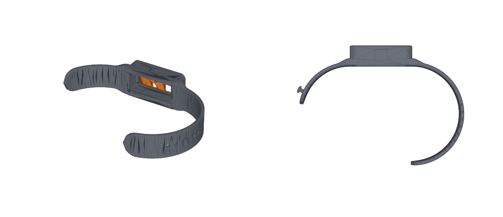

# StickS3 run display

A wrist display that shows two numbers while running: **heart rate** from a Bluetooth chest strap, and **pace** from the phone's GPS. Built on an [M5Stack StickS3](https://docs.m5stack.com/en/core/StickS3) in a cast silicone band, with a clip mount as an alternative to the band.

The point is to keep Strava recording on the phone, untouched, and still see live numbers without buying a running watch.


*Band v7, the current design: a one-piece silicone band that flows out of a sealed jacket around the Stick, with Tropic-shaped straps. The long strap tapers to a squared 12 mm tip; the short strap ends in a 4.5 mm thick tab with a cast hole for the spring bar of a real metal Tropic buckle and a slot for its tongue. The outer faces carry a recessed diamond-knurl panel inside a 0.7 mm raised outline. Drawn from the mesh in `hardware/sleeve_v7/`.*

The earlier one-piece silicone band (a pocket in a cast band, no strap hardware) is still in `hardware/band/`:



## How it fits together

```
chest strap ──BLE──▶ phone ──BLE──▶ StickS3
                      │
              Strava (records the run, reads the strap itself)
              companion app (reads the strap, computes GPS pace,
                             sends both numbers ~1x/second)
```

The Stick never talks to the strap. It receives two numbers and displays them.

## Layout

| Path | What |
|---|---|
| `hardware/band/` | one-piece silicone band: 3-part mold (OpenSCAD source + STLs) |
| `hardware/clip/` | printed cradle that bolts to a steel spring clip (source + STLs) |
| `hardware/sleeve_v2/` | sealed silicone sleeve with cast-in lug staples for a standard 22 mm watch strap (source + STLs) |
| `hardware/sleeve_v3/` | sealed sleeve with the lugs under the ends (buried PETG frame with fins), 52 mm long (source + STLs) |
| `hardware/sleeve_v4/` | v3 with the frame flush in the back, 16 mm tall (source + STLs) |
| `hardware/sleeve_v5/` | one-piece silicone band + sealed jacket with a PETG peg buckle, Fitbit-style; cast twice (source + STLs) |
| `hardware/sleeve_v6/` | v5 band with a cast-in printed tang buckle, diamond-knurl straps, cast port slot; cast and run in (source + STLs) |
| `hardware/sleeve_v7/` | current: Tropic-shaped tapered straps for a real metal Tropic buckle (cast spring-bar hole and tongue slot), raised outline, nothing printed in the band (source + STLs) |
| `hardware/sleeve/` | earlier sleeve with a cast-in lug frame; superseded, kept for reference |
| `firmware/` | StickS3 firmware — not started |
| `app/` | Android companion app — not started |
| `docs/build-notes.md` | print settings, casting steps, assembly, tuning the fit |
| `docs/shopping-list.md` | everything to buy, with part numbers |

## Status

- **Band:** printed, cast and worn; fits well.
- **Sleeve:** v2 printed and cast, fits the Stick and the strap. v3 (lugs under the ends, 13 mm shorter) cast once: fit and strap work, but it sat 1 mm higher than the band and the first mold locked. v4 (frame flush with the back, 16 mm tall) is designed and verified. v5 drops the separate strap altogether: a one-piece band with the sealed jacket and a PETG peg buckle, cast twice and worn; the peg closure was awkward to use. v6 swapped in a printed tang buckle cast into the short strap: cast and run in, but the spring bar popped out of the printed lugs. v7 drops printed hardware altogether: Tropic-shaped straps that take a metal Tropic buckle on its own spring bar, designed and verified, not yet printed.
- **Clip mount:** designed, not printed.
- **Firmware and app:** working. Real chest-strap heart rate reaches the Stick over BLE while Strava records the same strap; GPS pace is implemented but the outdoor walk test and the Stick battery run-down are still to do.

## Design decisions worth knowing

- **Dimensions** come from M5Stack's K150 drawing and official 3D model, not from measurements.
- **The Stick slips in and out of the band** — the silicone lip holds it, and the pocket covers USB-C, so charging means popping it out.
- **The clip keeps USB-C reachable,** so it charges in place.
- **All fasteners** come from one M2/M3 metric screw assortment.
