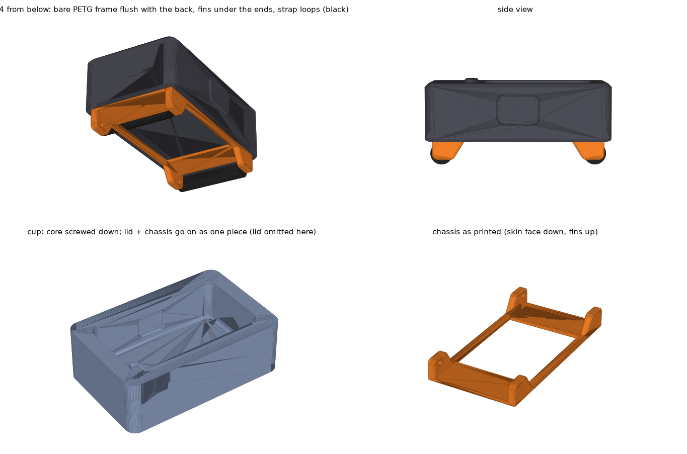
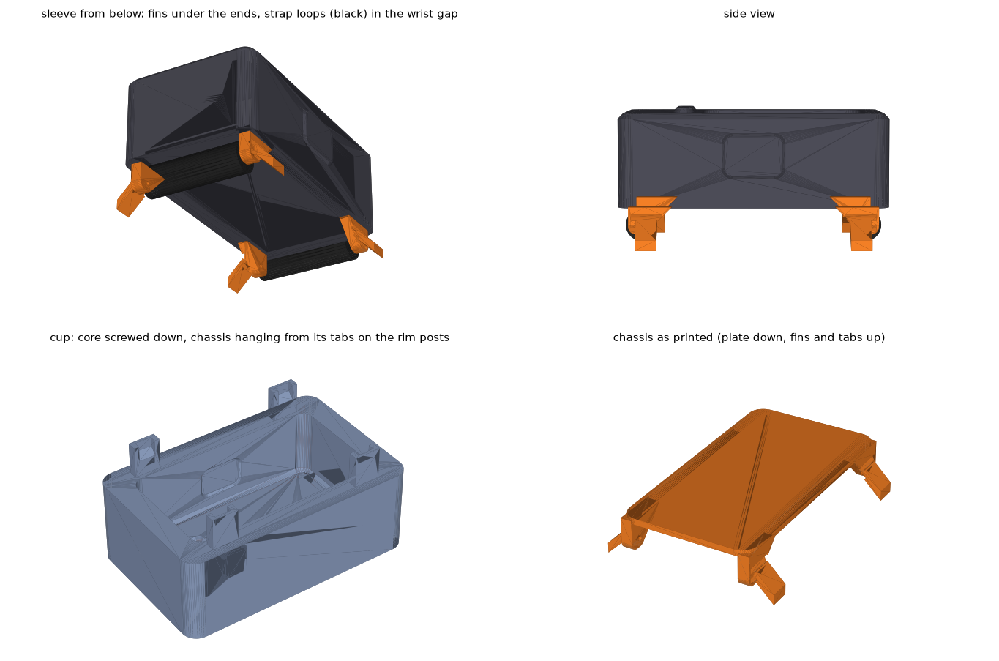

# Build notes

Everything dimensional comes from M5Stack's StickS3 (K150) drawing and official 3D model. Band sized for a 165 mm wrist.

## Files

| File | What | Print |
|---|---|---|
| `hardware/band/stl/band_mold_bottom.stl` | band mold, bottom half | PLA, as exported (parting face up), no supports, 0.12 mm layers |
| `hardware/band/stl/band_mold_top.stl` | top half (pour hole + vents) | same |
| `hardware/band/stl/band_core_default.stl` | forms the Stick pocket | PLA, as exported (on its side), 0.12 mm layers |
| `hardware/band/stl/band_core_tighter.stl`, `band_core_looser.stl` | pocket 0.1 mm tighter / looser per side | same; the mold halves never change |
| `hardware/band/stl/band_preview_not_for_printing.stl` | what the finished band looks like | don't print |
| `hardware/clip/stl/clip_mount_631.stl` | cradle for theclip.com MCS-631SS (stainless, recommended) | PETG, flat side down, no supports, 5 walls, 100% infill |
| `hardware/clip/stl/clip_mount_661.stl` | cradle for MCS-661 (coated steel, same length as the Stick) | same |
| `hardware/band/band_mold.scad`, `hardware/clip/clip_mount.scad` | editable sources (OpenSCAD) | |

## Hardware

All of it comes from one metric screw assortment (M2/M3, socket-cap or button head, with nuts and washers):

- 2 x M2x6 — hold the Stick in the clip cradle
- 2 x M3x4 or M3x5 — bolt the steel clip on (with M3x6, add a washer under each head)
- 8 x M3x30 + 8 nuts — clamp the mold
- 2 x M3 nuts — clip cradle

## Changing the design

Open a `.scad` in OpenSCAD, edit the values at the top, render (F6), export STL. Or from a shell:

```
openscad -o core.stl -D 'part="core"' -D 'squeeze=0.25' hardware/band/band_mold.scad
openscad -o clip.stl -D 'clip_model="661"' hardware/clip/clip_mount.scad
```

`squeeze` only affects the core, so tuning the grip never means reprinting the two big mold halves.

## Rendering without a GUI

The `tools/` folder is not in the repo. Either install OpenSCAD normally, or fetch the AppImage and M5Stack's reference model:

```
curl -L -o openscad.AppImage https://files.openscad.org/snapshots/OpenSCAD-2026.09.16-x86_64.AppImage
chmod +x openscad.AppImage && ./openscad.AppImage --appimage-extract    # runs without FUSE
curl -L -O https://raw.githubusercontent.com/m5stack/M5_Hardware/master/Products/K150_StickS3/Structures/StickS3.stl
```

## Band: casting

1. Sand both parting faces flat. Spray the halves and the core with Ease Release 200.
2. Lay the core in the bottom half: window pads against the cavity walls, side-button post in its side pocket. Close the top half. Bolt with 8 x M3x30 + nuts, snug. Heads and nuts drop into the pockets on the outer faces.
3. Vinyl gloves, never latex. The band needs ~18 ml, but cups, sticks and the syringe swallow a lot, so **mix at least 2x that: 20 g Part A + 20 g Part B** (Smooth-Sil 945 is 1A:1B by weight, 25 min pot life). For black, stir pigment into Part A first at **3% of total weight (about 1.2 g for 40 g)**, the maximum Smooth-On allows. The 945 base cures a strong purple; 1.5% black left it visibly purple, so use the full 3% and a concentrated pigment such as Silc Pig.
4. Inject slowly through the pour hole with a 60 ml syringe until silicone shows at every vent. Tap the mold on the table to free bubbles.
5. Wait 6 h (Smooth-Sil 945; SORTA-Clear 37 is 4 h). Unbolt, lift the band and core out, stretch the front lip over the core to pop it out. Trim the vent nubs and the seam.
6. Punch the 7 strap holes with a 3 mm leather punch, centred between the notches on the strap edges.

Test first: cure a 10 g cup with your pigment in it. If it sets firm overnight, cast the band.

The band sits across the wrist. Hole 3 of 7 is about 164 mm, hole 4 about 170 mm, 6 mm per hole. USB-C is covered, so pop the Stick out to charge.

## Clip: assembly

1. Drop 2 M3 nuts into the hex pockets inside the cradle.
2. Tilt the Stick's USB-C end up a little, slide its top end under the lip against the end wall, lower it, then screw it down from underneath with 2 x M2x6 socket-cap or button-head screws. They sit in counterbores, flush with the bottom. Never longer: the Stick's threaded holes are only ~3 mm deep with electronics behind them.
3. Bolt the clip on with 2 x M3x4 or M3x5 screws through the clip's own holes. The slots allow +/-3 mm, since the clip drawings don't dimension where the holes sit along its length.

USB-C stays open, so it charges on the clip.

## Sleeve v2 (`hardware/sleeve_v2/`)


A sealed silicone jacket around the Stick (2.6 mm walls, 2.5 mm back, 2.0 mm over the face) with two PETG **staples** cast into its thick end blocks: each is a 3 x 5 mm bar buried across the width, with two lug plates that sweep down under the nose to the spring bar. The plates' outer faces sit 0.3 mm inside the sleeve's sides, pressed against matching pads on the cup wall, so they cast as crisp recessed black rectangles either side of each nose (no thin film of silicone to wear through); the bar's ends are buried 1.3 mm. The strap tucks under the nose. The only opening is the screen window (19 x 31.5 mm); the buttons are covered, with a 0.5 mm pad over each side button and 2 mm of silicone over the front button. A 14 x 7.5 mm **charging tunnel** runs through the USB-C end block to the port, closed at the nose by a 2 mm skin (3.5 mm at the ends) that you slit after curing: the plug pushes through, the slit closes behind it. The tunnel floor clears the staple bar by 0.9 mm. 65.4 x 28.6 x 18.3 mm, lug gap 21.4 mm. Fit is tight (0.3 mm squeeze per side). Silicone does not bond to PETG, so the staples hold by being buried: pulling one out means tearing through 8.5 mm of silicone.

One mold piece, one core, two staples:

| File | What | Print |
|---|---|---|
| `stl/sleeve_staple.stl` | lug staple with break-off locating tabs, print **two** | **PETG**, as exported (upside down, bar on the bed), brim, no supports, 100% infill, elephant-foot compensation 0.15 mm |
| `stl/sleeve_core.stl` | the Stick's shape + the window pad + the tunnel block | PLA, as exported, 3 walls, **supports on, build plate only** (only the tunnel block gets one, a 6 mm pad beside the core that snaps off) |
| `stl/sleeve_cup.stl` | the mold: window face at the bottom, walls, noses, rim notches, two M3 holes in the floor; open top | PLA, as exported, no supports, 0.16 mm |
| `stl/sleeve_cup_fused.stl` | **alternative to cup + core:** the same cup with the core grown out of the floor through the window | PLA, as exported (**rim down**), supports on **build plate only**, threshold 50°, 0.16 mm |
| `stl/sleeve_lid.stl` | optional lid: a plate with lug slots and two vents that sits on the rim on 0.3 mm feet, for a flat back instead of a card-scraped one | PLA, as exported (flat, feet up), no supports |
| `stl/sleeve_preview_not_for_printing.stl` | the finished silicone part | don't print |

**Casting** (open pour, window face down): spray release on the cup, core and staples. Stand the core on the cup floor, pad down, tunnel block toward the deeper nose, and drive **two M3 x 8 screws** up through the holes in the cup's underside into the core (they self-tap; the heads sit in recesses so the cup still stands flat). Without them the core floats: printed PLA is about half the density of the silicone. Drop the staples into the rim notches, lugs up, and push them down so the plates seat between the pads on the cup wall (light push fit; if one binds, sand the plate's outer face, not the cup). The tabs rest on the notch floors and set the height. **Mix 15 g A + 15 g B** with 3-4% pigment. Fill with the syringe from the bottom up: tip down beside the core into the lip layer and the front-button pocket first, then fill to just above the rim. Tap the cup on the table, top up, scrape the surface flat with a card across the rim. Cure overnight. **With the lid:** overfill by 1-2 mm instead of scraping, tap, then within a few minutes of mixing lower the sprayed lid over the lugs and press it onto the rim; excess bleeds out at the edges, the slots and the two vents. Wipe the squeeze-out. After curing, snip the two vent nubs off the back. Card-scraping leaves faint ripples where the film relevels unevenly; the lid or a plain unscraped overfill (self-levels, trim the flash) both avoid that. It is the wrist side either way. Flex the cup and lift the sleeve out with the core inside. Take the two screws out, work one end of the core up through the window and slide it out. **Tabs:** each has a 0.6 mm neck just outside the silicone; grip the tab with pliers and twist, it parts at the neck. Shave any burr with a razor blade lying flat on the lug plate (the plate is flush with the sleeve's side, so the blade rides on PETG, not silicone). Don't sand near the silicone. **Cut the port slit:** lay the sleeve on its side, and with a fresh blade make one straight cut across the middle of the skin at the USB-C end, about 12 mm long, in a single stroke. Never saw at it. The slit ends land in the thick part of the skin; the tunnel behind is rounded, so there is no corner for a tear to start from.

**Fused cup (no loose core).** `sleeve_cup_fused.stl` is the cup and core in one piece, so the only things to place are the two staples. It prints rim down: the core then stands on a 2.5 mm slab of slicer support that sits on the bed under it (the space that becomes the sleeve's back), and the front face of the mold is bridged over the 2 mm lip gap (the longest bridge is 15 mm at the USB-C end). In the slicer turn supports on, "on build plate only", threshold angle 50° so the sloped noses are left alone, and normal (not tree) support so the slab comes out in one piece; if it also wants to support the bridged floor, add a support blocker there. After printing, pull the slab out from the open top. The front face of the sleeve comes out with a light bridge texture instead of the glossy bed finish, and the walls will be slightly rougher on the 46° nose slopes. Casting is the same, minus placing the core. **Demolding is harder:** the sleeve has to come off the core while it is still in the rigid cup, the same stretch as fitting the Stick but with less room to work. Let it cure the full 24 h, then lift one end by its two lugs so the end block peels its lip out from under the core (start with the USB-C end, the deep lip), then the other end, then the sides. A drop of soapy water at the ends helps. With the loose core you lift core and sleeve out together and peel the core out in your hand, which is why the two-piece version is still the default.

**Fitting the Stick:** USB-C end first, under the deep lip, then stretch the short lip over the top end. Spring bars (0.8 mm tips) through the lugs; open the holes with a 1.0 mm bit if a print closed them. To charge, push the cable straight into the slit at the USB-C end; the tunnel guides it onto the port. Set `port = false` in the .scad for a sleeve without the tunnel.

## Sleeve v4 (`hardware/sleeve_v4/`)



v3 with the PETG frame moved **outside** the silicone: the two end brackets and two side rails sit flush in the back surface with their faces bare, like a watch caseback, and the fins grow straight off the brackets. The back is 1.5 mm (1.0 frame + 0.5 silicone skin under the Stick, so the pocket stays sealed and no PETG touches the Stick or passes through silicone), the lip over the face is 0.8. **51.8 x 29.0 x 16.1 mm, 17.0 at the front button**, against 17.2 / 18.1 for v3 and roughly 17 for the band. Frame edges on the silicone side are rounded (0.4 mm); the exposed faces have clean square perimeters so the silicone meets a vertical wall, not a feather edge.

No rim posts or tabs: the **lid locates the frame**. Four slots in the lid are 0.1 mm narrower than the fins; the lid is pushed onto the fins dry until the frame's back is flat against it, and lid + frame go onto the poured cup as one piece. Wherever the lid touched PETG the face comes out bare, so there is no film to wear through. The lid also carries the fillet ridge that rounds the back edge (cup rim straight, with a rebate), and the cup floor has two M4 jack holes for demolding.

| File | What | Print |
|---|---|---|
| `stl/sleeve_chassis.stl` | frame (2 brackets, 2 rails) + 4 fins | **PETG**, as exported (skin-side face on the bed, fins up), brim, no supports, 100% infill. Check the 1.0 mm bar holes with a spring bar tip |
| `stl/sleeve_core.stl` | Stick shape + 0.8 mm window pad + port pocket | PLA, as exported, no supports, 3 walls |
| `stl/sleeve_cup.stl` | open-top mold, straight rim with rebate, M3 clamp holes, M4 jack holes | PLA, as exported, no supports, 0.16 mm |
| `stl/sleeve_lid.stl` | lid with fillet ridge, press-fit fin slots and two vents | PLA, as exported (flat, ridge up), no supports. If a slot is too tight, sand the fin, not the slot |
| `stl/sleeve_preview_not_for_printing.stl` | the finished silicone | don't print |

**Casting:** release on everything. Core on the floor, pad down, two M3 x 8 up through the cup. Push the lid onto the chassis fins until the frame's back is flat on the lid's underside. **Mix 12 g A + 12 g B** with pigment (cast volume is 7.7 cm3). Syringe the lip layer and the front-button pocket first, pour to about 1 mm above the rim, tap. Lower lid + frame together, one end first so air escapes from under the brackets, press onto the rim; excess bleeds from the vents and slots. Cure 24 h or 6 h at 45 C. **Demolding:** cut the flash round the lid's edge with a blade and lever a corner; the lid lifts off and the frame stays in the sleeve. M3 screws out, card down the long sides, then two M4 screws into the jack holes turned alternately until the core and sleeve rise out. Peel the short-lip end off the core, slide the core out through the window, cut the port slit (12 mm, horizontal, centred on the USB-C end wall where it dents under a fingernail).

## Sleeve v3 (`hardware/sleeve_v3/`)



Same sealed jacket as v2, but the strap lugs are **under the ends instead of past them**, so the sleeve is 51.8 x 29.0 x 17.2 mm (+0.9 button bump) against v2's 65.4 x 28.6 x 18.3 and the band's roughly 16 over the wrist, with a 0.8 mm round on the back edge. The round is formed by a fillet ridge on the **lid**, never by an undercut in the cup: the first cast used a rim lip and the sleeve had to be cut out of the mold. The cup's rim is straight, with a 0.9 mm rebate the ridge sits in. A PETG **chassis frame** with every edge rounded (0.4 mm radius, so nothing sharp bears on the silicone) is buried in the 2.4 mm back layer: two 1.2 mm end brackets under the ends of the Stick, joined by two 1.0 x 2.2 mm rails along the sides under the pocket's edge. The rails carry the strap tension (about 20 kgf) but bend easily, so the middle of the back is plain silicone and the sleeve still flexes to get the Stick in and out (a full plate, tried first, made that hard). 0.4 mm of silicone sits between the brackets and the Stick, 0.8 mm between them and the wrist. The lip over the face is 1.0 mm: it retains and seals, and it is what sets the height. Four **fins** grow down from the brackets inside the sleeve's footprint, 2.2 mm thick with 1.6 mm of silicone outside them, and protrude 5.1 mm below the back. The 22 mm spring bar spans each pair (21.4 mm gap, 1.0 mm blind holes), so the strap end wraps a bar 3.5 mm under the sleeve's end, in the gap a straight sleeve leaves over a curved wrist. Strap tension goes into the plate, not the silicone. Nothing is closer than 0.5 mm to a surface and the only PETG you see is the fins.

The chassis hangs in the mold from four **tabs that rest on posts on the cup rim**, entirely above the pour, so nothing gets cut near silicone: the tabs sit on 45-degree seats and slide outward until their tips meet a stop wall, which centres the chassis and sets its height. Twist them off at their 0.6 mm necks afterwards.

| File | What | Print |
|---|---|---|
| `stl/sleeve_chassis.stl` | frame (2 brackets, 2 rails) + 4 fins + 4 tabs | **PETG**, as exported (plate on the bed), brim, no supports, 100% infill, 245-250 C, fan 20-30%. Check the 1.0 mm bar holes with a spring bar tip; open with a 1 mm bit if needed |
| `stl/sleeve_core.stl` | Stick shape + window pad + port pocket | PLA, as exported (back face down), no supports, 3 walls; the port pocket is only 0.7 mm proud so it prints without support |
| `stl/sleeve_cup.stl` | open-top mold, straight rim with a rebate for the lid ridge, four rim posts, two M3 clamp holes and two M4 jack holes in the floor | PLA, as exported (open top up), no supports, 0.16 mm |
| `stl/sleeve_lid.stl` | lid with the fillet ridge that rounds the back edge, and openings for the fins, tabs and posts. Use it; without it the back edge is square | PLA, as exported, no supports |
| `stl/sleeve_preview_not_for_printing.stl` | the finished silicone | don't print |

**Casting** (open pour, window face down, same as v2): release on everything. Core on the floor, pad down, two M3 x 8 screws up through the cup's underside. **Mix 17 g A + 17 g B** with pigment. Syringe the lip layer and the front-button pocket first, then pour until the core's back is under about a millimetre of silicone. Lower the chassis in, fins up, one end first so the air runs out from under the plate, until the tabs land on the posts; press gently until the tab tips touch the stop walls. Top up to just above the rim, tap, then press the sprayed lid on (its ridge forms the rounded back edge; excess comes out of the openings). Cure 24 h, or about 6 h with the cup on the printer bed at 45 C: the preheat menu times out after ~10 min, so send `tools/bedhold_45c_ff.gcode` as a print job instead (it only holds the bed, no motion; stop the job to end it early). **Demolding:** cut the flash round the lid's edge with a blade and lever a corner; it lifts straight off the fins. M3 screws out. Slide a card down both long sides to the floor to break the vacuum. Then two **M4 screws into the jack holes** in the floor (the two plain holes between the M3 recesses), turned alternately a couple of turns at a time: they tap the PLA and push the core's pad, and the core lifts the sleeve out. Never pry against the silicone edge or pull on the tabs. Peel the short-lip end off the core, slide the core out through the window. Small tears from a bad demold can be glued with Sil-Poxy (not superglue, not fresh 945); glued tears in a lip will reopen eventually, tears in the back or walls hold. Twist the tabs off and shave the stubs with a blade flat on the fin. Cut the port slit: 12 mm, horizontal, centred on the USB-C end wall, where it dents under a fingernail; the wall is 1.5 mm there and 2.2 mm at the slit ends.

**Strap:** spring bars into the fin holes from between the fins. The strap end sits under the sleeve's end and leaves downward.

`hardware/sleeve/` is the earlier design: a thinner sleeve with a PETG lug frame cast into its back. Kept with its STLs for reference.
