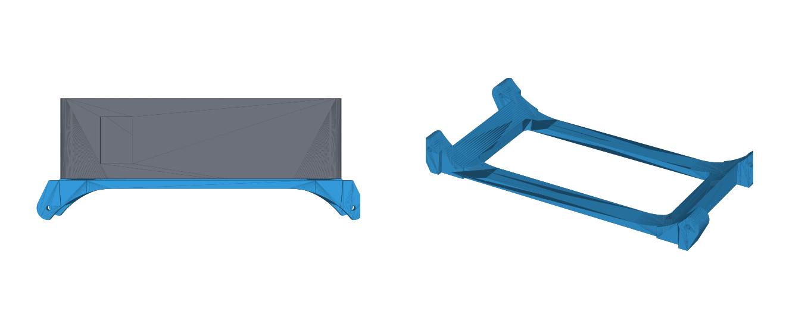

# Build notes

Everything dimensional comes from M5Stack's StickS3 (K150) drawing and official 3D model. Band sized for a 165 mm wrist.

## Files

| File | What | Print |
|---|---|---|
| `hardware/band/stl/band_mold_bottom.stl` | band mold, bottom half | PLA, as exported (parting face up), no supports, 0.12 mm layers |
| `hardware/band/stl/band_mold_top.stl` | top half (pour hole + vents) | same |
| `hardware/band/stl/band_core_default.stl` | forms the Stick pocket | PLA, as exported (on its side), 0.12 mm layers |
| `hardware/band/stl/band_core_tighter.stl`, `band_core_looser.stl` | pocket 0.1 mm tighter / looser per side | same; the mold halves never change |
| `hardware/band/stl/band_preview_not_for_printing.stl` | what the finished band looks like | don't print |
| `hardware/clip/stl/clip_mount_631.stl` | cradle for theclip.com MCS-631SS (stainless, recommended) | PETG, flat side down, no supports, 5 walls, 100% infill |
| `hardware/clip/stl/clip_mount_661.stl` | cradle for MCS-661 (coated steel, same length as the Stick) | same |
| `hardware/band/band_mold.scad`, `hardware/clip/clip_mount.scad` | editable sources (OpenSCAD) | |

## Hardware

All of it comes from one metric screw assortment (M2/M3, socket-cap or button head, with nuts and washers):

- 2 x M2x6 — hold the Stick in the clip cradle
- 2 x M3x4 or M3x5 — bolt the steel clip on (with M3x6, add a washer under each head)
- 8 x M3x30 + 8 nuts — clamp the mold
- 2 x M3 nuts — clip cradle

## Changing the design

Open a `.scad` in OpenSCAD, edit the values at the top, render (F6), export STL. Or from a shell:

```
openscad -o core.stl -D 'part="core"' -D 'squeeze=0.25' hardware/band/band_mold.scad
openscad -o clip.stl -D 'clip_model="661"' hardware/clip/clip_mount.scad
```

`squeeze` only affects the core, so tuning the grip never means reprinting the two big mold halves.

## Rendering without a GUI

The `tools/` folder is not in the repo. Either install OpenSCAD normally, or fetch the AppImage and M5Stack's reference model:

```
curl -L -o openscad.AppImage https://files.openscad.org/snapshots/OpenSCAD-2026.09.16-x86_64.AppImage
chmod +x openscad.AppImage && ./openscad.AppImage --appimage-extract    # runs without FUSE
curl -L -O https://raw.githubusercontent.com/m5stack/M5_Hardware/master/Products/K150_StickS3/Structures/StickS3.stl
```

## Band: casting

1. Sand both parting faces flat. Spray the halves and the core with Ease Release 200.
2. Lay the core in the bottom half: window pads against the cavity walls, side-button post in its side pocket. Close the top half. Bolt with 8 x M3x30 + nuts, snug. Heads and nuts drop into the pockets on the outer faces.
3. Vinyl gloves, never latex. The band needs ~18 ml, but cups, sticks and the syringe swallow a lot, so **mix at least 2x that: 20 g Part A + 20 g Part B** (Smooth-Sil 945 is 1A:1B by weight, 25 min pot life). For black, stir pigment into Part A first at **3% of total weight (about 1.2 g for 40 g)**, the maximum Smooth-On allows. The 945 base cures a strong purple; 1.5% black left it visibly purple, so use the full 3% and a concentrated pigment such as Silc Pig.
4. Inject slowly through the pour hole with a 60 ml syringe until silicone shows at every vent. Tap the mold on the table to free bubbles.
5. Wait 6 h (Smooth-Sil 945; SORTA-Clear 37 is 4 h). Unbolt, lift the band and core out, stretch the front lip over the core to pop it out. Trim the vent nubs and the seam.
6. Punch the 7 strap holes with a 3 mm leather punch, centred between the notches on the strap edges.

Test first: cure a 10 g cup with your pigment in it. If it sets firm overnight, cast the band.

The band sits across the wrist. Hole 3 of 7 is about 164 mm, hole 4 about 170 mm, 6 mm per hole. USB-C is covered, so pop the Stick out to charge.

## Clip: assembly

1. Drop 2 M3 nuts into the hex pockets inside the cradle.
2. Tilt the Stick's USB-C end up a little, slide its top end under the lip against the end wall, lower it, then screw it down from underneath with 2 x M2x6 socket-cap or button-head screws. They sit in counterbores, flush with the bottom. Never longer: the Stick's threaded holes are only ~3 mm deep with electronics behind them.
3. Bolt the clip on with 2 x M3x4 or M3x5 screws through the clip's own holes. The slots allow +/-3 mm, since the clip drawings don't dimension where the holes sit along its length.

USB-C stays open, so it charges on the clip.

## Planned: Tropic-strap sleeve

A silicone sleeve (same pocket as the band, no straps) with a thin PETG lug frame cast into its back wall, so a standard 22 mm strap attaches with spring bars. Built: see "Sleeve parts" below. Thickness 16.6 mm, same as the band; lug gap 21.4 mm; bar 2 mm out from the end wall, horns 4.2 mm proud, 60 mm tip to tip.

Measured from the Tropic strap on 2026-09-23: end width 21 mm; thickness at the end 5.7 mm, tapering to 4.2 mm at the edges; spring-bar tip diameter 0.8 mm (print holes at 1.0 mm, drill to fit). Bar centre planned ~4 mm out from the end wall, ~3 mm up from the bottom.

### Sleeve parts (`hardware/sleeve/`)



| File | What | Print |
|---|---|---|
| `stl/sleeve_frame.stl` | lug frame, cast into the sleeve's back | **PETG**, flat as exported, 4 walls, 100% infill |
| `stl/sleeve_core.stl` | forms the pocket; has side ribs for the button openings | PLA, as exported, **supports on (build plate only)** |
| `stl/sleeve_mold_bottom.stl` | shallow tray | PLA, as exported, 0.16 mm |
| `stl/sleeve_mold_top.stl` | cavity half, side pour hole, 8 top vents | PLA, as exported (cavity up), 0.16 mm |
| `stl/sleeve_preview_not_for_printing.stl` | the finished silicone part | don't print |

Casting the sleeve: spray all four pieces with release. Drop the **frame** into the tray, horns in their slots, bar holes toward the ends. Stand the **core** in the frame's opening, back pad down; its ribs must point at the long sides. Lower the top half on (the diagonal pins only fit one way), 4 × M3×30 + nuts, snug. Inject through the **side pour hole** on the long side until silicone shows at all 8 vents on top. Cure, lift the top off, lift the sleeve + core + frame out of the tray, stretch the front lip over the core to pop it out. The frame stays in the silicone. Silicone needed ≈ 5 ml; **mix 10 g A + 10 g B** (2× for what stays in the cups and syringe). Fit the Tropic strap with 22 mm spring bars (0.8 mm tips); open the horn holes with a 1.0 mm bit if a print closed them up. The horns are 3 mm thick in the wall and flare to 4 mm outside it; print the frame in PETG at 245-250 C with the part fan at 20-30% so the layers fuse, let the plate cool fully and flex it to release. Never lever the part up by the horns.

There's a 0.2 mm air gap between the frame's opening and the Stick's back rim by design; it isn't a void in the silicone.
