# Build notes

Everything dimensional comes from M5Stack's StickS3 (K150) drawing and official 3D model. Band sized for a 165 mm wrist.

## Files

| File | What | Print |
|---|---|---|
| `hardware/band/stl/band_mold_bottom.stl` | band mold, bottom half | PLA, as exported (parting face up), no supports, 0.12 mm layers |
| `hardware/band/stl/band_mold_top.stl` | top half (pour hole + vents) | same |
| `hardware/band/stl/band_core_default.stl` | forms the Stick pocket | PLA, as exported (on its side), 0.12 mm layers |
| `hardware/band/stl/band_core_tighter.stl`, `band_core_looser.stl` | pocket 0.1 mm tighter / looser per side | same; the mold halves never change |
| `hardware/band/stl/band_preview_not_for_printing.stl` | what the finished band looks like | don't print |
| `hardware/clip/stl/clip_mount_631.stl` | cradle for theclip.com MCS-631SS (stainless, recommended) | PETG, flat side down, no supports, 5 walls, 100% infill |
| `hardware/clip/stl/clip_mount_661.stl` | cradle for MCS-661 (coated steel, same length as the Stick) | same |
| `hardware/band/band_mold.scad`, `hardware/clip/clip_mount.scad` | editable sources (OpenSCAD) | |

## Hardware

All of it comes from one metric screw assortment (M2/M3, socket-cap or button head, with nuts and washers):

- 2 x M2x6 — hold the Stick in the clip cradle
- 2 x M3x4 or M3x5 — bolt the steel clip on (with M3x6, add a washer under each head)
- 8 x M3x30 + 8 nuts — clamp the mold
- 2 x M3 nuts — clip cradle

## Changing the design

Open a `.scad` in OpenSCAD, edit the values at the top, render (F6), export STL. Or from a shell:

```
openscad -o core.stl -D 'part="core"' -D 'squeeze=0.25' hardware/band/band_mold.scad
openscad -o clip.stl -D 'clip_model="661"' hardware/clip/clip_mount.scad
```

`squeeze` only affects the core, so tuning the grip never means reprinting the two big mold halves.

## Rendering without a GUI

The `tools/` folder is not in the repo. Either install OpenSCAD normally, or fetch the AppImage and M5Stack's reference model:

```
curl -L -o openscad.AppImage https://files.openscad.org/snapshots/OpenSCAD-2026.09.16-x86_64.AppImage
chmod +x openscad.AppImage && ./openscad.AppImage --appimage-extract    # runs without FUSE
curl -L -O https://raw.githubusercontent.com/m5stack/M5_Hardware/master/Products/K150_StickS3/Structures/StickS3.stl
```

## Band: casting

1. Sand both parting faces flat. Spray the halves and the core with Ease Release 200.
2. Lay the core in the bottom half: window pads against the cavity walls, side-button post in its side pocket. Close the top half. Bolt with 8 x M3x30 + nuts, snug. Heads and nuts drop into the pockets on the outer faces.
3. Vinyl gloves, never latex. The band needs ~18 ml, but cups, sticks and the syringe swallow a lot, so **mix at least 2x that: 20 g Part A + 20 g Part B** (Smooth-Sil 945 is 1A:1B by weight, 25 min pot life). For black, stir pigment into Part A first at **3% of total weight (about 1.2 g for 40 g)**, the maximum Smooth-On allows. The 945 base cures a strong purple; 1.5% black left it visibly purple, so use the full 3% and a concentrated pigment such as Silc Pig.
4. Inject slowly through the pour hole with a 60 ml syringe until silicone shows at every vent. Tap the mold on the table to free bubbles.
5. Wait 6 h (Smooth-Sil 945; SORTA-Clear 37 is 4 h). Unbolt, lift the band and core out, stretch the front lip over the core to pop it out. Trim the vent nubs and the seam.
6. Punch the 7 strap holes with a 3 mm leather punch, centred between the notches on the strap edges.

Test first: cure a 10 g cup with your pigment in it. If it sets firm overnight, cast the band.

The band sits across the wrist. Hole 3 of 7 is about 164 mm, hole 4 about 170 mm, 6 mm per hole. USB-C is covered, so pop the Stick out to charge.

## Clip: assembly

1. Drop 2 M3 nuts into the hex pockets inside the cradle.
2. Tilt the Stick's USB-C end up a little, slide its top end under the lip against the end wall, lower it, then screw it down from underneath with 2 x M2x6 socket-cap or button-head screws. They sit in counterbores, flush with the bottom. Never longer: the Stick's threaded holes are only ~3 mm deep with electronics behind them.
3. Bolt the clip on with 2 x M3x4 or M3x5 screws through the clip's own holes. The slots allow +/-3 mm, since the clip drawings don't dimension where the holes sit along its length.

USB-C stays open, so it charges on the clip.

## Sleeve v2 (`hardware/sleeve_v2/`)

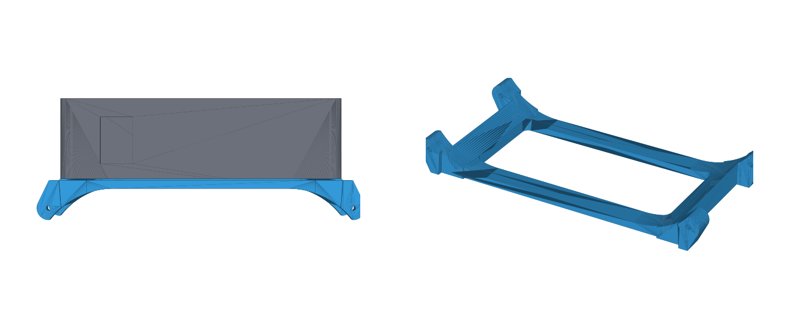

A sealed silicone jacket around the Stick (2.6 mm walls, 2.5 mm back, 2.0 mm over the face) with two PETG **staples** cast into its thick end blocks: each is a 3 x 5 mm bar buried across the width, with two lug plates that sweep down under the nose to the spring bar. The plates' outer faces sit 0.3 mm inside the sleeve's sides, pressed against matching pads on the cup wall, so they cast as crisp recessed black rectangles either side of each nose (no thin film of silicone to wear through); the bar's ends are buried 1.3 mm. The strap tucks under the nose. The only opening is the screen window (19 x 31.5 mm); the buttons are covered, with a 0.5 mm pad over each side button and 2 mm of silicone over the front button. A 14 x 7.5 mm **charging tunnel** runs through the USB-C end block to the port, closed at the nose by a 2 mm skin (3.5 mm at the ends) that you slit after curing: the plug pushes through, the slit closes behind it. The tunnel floor clears the staple bar by 0.9 mm. 65.4 x 28.6 x 18.3 mm, lug gap 21.4 mm. Fit is tight (0.3 mm squeeze per side). Silicone does not bond to PETG, so the staples hold by being buried: pulling one out means tearing through 8.5 mm of silicone.

One mold piece, one core, two staples:

| File | What | Print |
|---|---|---|
| `stl/sleeve_staple.stl` | lug staple with break-off locating tabs, print **two** | **PETG**, as exported (upside down, bar on the bed), brim, no supports, 100% infill, elephant-foot compensation 0.15 mm |
| `stl/sleeve_core.stl` | the Stick's shape + the window pad + the tunnel block | PLA, as exported, 3 walls, **supports on, build plate only** (only the tunnel block gets one, a 6 mm pad beside the core that snaps off) |
| `stl/sleeve_cup.stl` | the mold: window face at the bottom, walls, noses, rim notches, two M3 holes in the floor; open top | PLA, as exported, no supports, 0.16 mm |
| `stl/sleeve_cup_fused.stl` | **alternative to cup + core:** the same cup with the core grown out of the floor through the window | PLA, as exported (**rim down**), supports on **build plate only**, threshold 50°, 0.16 mm |
| `stl/sleeve_lid.stl` | optional lid: a plate with lug slots and two vents that sits on the rim on 0.3 mm feet, for a flat back instead of a card-scraped one | PLA, as exported (flat, feet up), no supports |
| `stl/sleeve_preview_not_for_printing.stl` | the finished silicone part | don't print |

**Casting** (open pour, window face down): spray release on the cup, core and staples. Stand the core on the cup floor, pad down, tunnel block toward the deeper nose, and drive **two M3 x 8 screws** up through the holes in the cup's underside into the core (they self-tap; the heads sit in recesses so the cup still stands flat). Without them the core floats: printed PLA is about half the density of the silicone. Drop the staples into the rim notches, lugs up, and push them down so the plates seat between the pads on the cup wall (light push fit; if one binds, sand the plate's outer face, not the cup). The tabs rest on the notch floors and set the height. **Mix 15 g A + 15 g B** with 3-4% pigment. Fill with the syringe from the bottom up: tip down beside the core into the lip layer and the front-button pocket first, then fill to just above the rim. Tap the cup on the table, top up, scrape the surface flat with a card across the rim. Cure overnight. **With the lid:** overfill by 1-2 mm instead of scraping, tap, then within a few minutes of mixing lower the sprayed lid over the lugs and press it onto the rim; excess bleeds out at the edges, the slots and the two vents. Wipe the squeeze-out. After curing, snip the two vent nubs off the back. Card-scraping leaves faint ripples where the film relevels unevenly; the lid or a plain unscraped overfill (self-levels, trim the flash) both avoid that. It is the wrist side either way. Flex the cup and lift the sleeve out with the core inside. Take the two screws out, work one end of the core up through the window and slide it out. **Tabs:** each has a 0.6 mm neck just outside the silicone; grip the tab with pliers and twist, it parts at the neck. Shave any burr with a razor blade lying flat on the lug plate (the plate is flush with the sleeve's side, so the blade rides on PETG, not silicone). Don't sand near the silicone. **Cut the port slit:** lay the sleeve on its side, and with a fresh blade make one straight cut across the middle of the skin at the USB-C end, about 12 mm long, in a single stroke. Never saw at it. The slit ends land in the thick part of the skin; the tunnel behind is rounded, so there is no corner for a tear to start from.

**Fused cup (no loose core).** `sleeve_cup_fused.stl` is the cup and core in one piece, so the only things to place are the two staples. It prints rim down: the core then stands on a 2.5 mm slab of slicer support that sits on the bed under it (the space that becomes the sleeve's back), and the front face of the mold is bridged over the 2 mm lip gap (the longest bridge is 15 mm at the USB-C end). In the slicer turn supports on, "on build plate only", threshold angle 50° so the sloped noses are left alone, and normal (not tree) support so the slab comes out in one piece; if it also wants to support the bridged floor, add a support blocker there. After printing, pull the slab out from the open top. The front face of the sleeve comes out with a light bridge texture instead of the glossy bed finish, and the walls will be slightly rougher on the 46° nose slopes. Casting is the same, minus placing the core. **Demolding is harder:** the sleeve has to come off the core while it is still in the rigid cup, the same stretch as fitting the Stick but with less room to work. Let it cure the full 24 h, then lift one end by its two lugs so the end block peels its lip out from under the core (start with the USB-C end, the deep lip), then the other end, then the sides. A drop of soapy water at the ends helps. With the loose core you lift core and sleeve out together and peel the core out in your hand, which is why the two-piece version is still the default.

**Fitting the Stick:** USB-C end first, under the deep lip, then stretch the short lip over the top end. Spring bars (0.8 mm tips) through the lugs; open the holes with a 1.0 mm bit if a print closed them. To charge, push the cable straight into the slit at the USB-C end; the tunnel guides it onto the port. Set `port = false` in the .scad for a sleeve without the tunnel.

## Band v8 (`hardware/sleeve_v8/`)

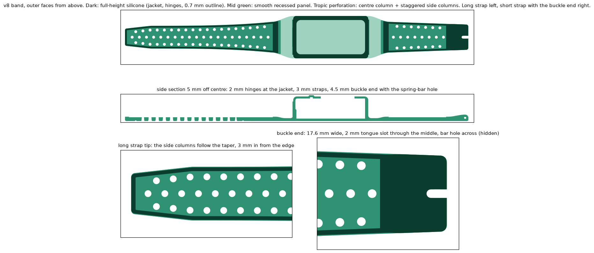

v7 cast twice in 950 and both casts had craters: a 1 cm paper-thin spot on a strap, a 1 cm bare patch over the front button, and pinholes across the wrist face. The big ones are air that was never displaced (the button recess is a dead-end pocket pointing at the cup floor, and the knurl was 280 small ones); the pinholes are mixing bubbles that rose and were stopped by the lid. v8 is v7 with:

- **Tropic perforation on both straps:** a centre column of 2 mm holes at 5 mm pitch plus two side columns 4 mm off centre, staggered half a pitch, from just past the flare to 5 mm from the tip (long) and to the thick end (short); the side columns stop where less than 2.5 mm would be left to the edge (the last 13 mm of the long strap). 76 holes. The tongue uses the centre column, so sizes run 140 to 235 in 5 mm steps. On the wrist face each hole has a 0.3 mm chamfer.
- **Tropic diamonds on the outer faces** (`tex_mode = "tropic"`): the whole panel is tiled with diamond pits, 5 mm along by 8 mm across, each a shallow inverted pyramid 0.6 mm deep with faces at about 27 degrees and a small flat floor, separated by a 0.7 mm raised lattice. The pits sit on the hole lattice, so every hole in the three columns is at the centre of its pit, and the outer columns of pits have no holes, exactly like the Tropic. Partial pits run out to the 0.7 mm raised outline. In the cup the pits are flat-topped bumps and the lattice is a network of channels that is connected everywhere (checked: one piece, never narrower than 0.6 mm), so air on the strap floors always has a way to the edge; brush anyway. The v7 knurl is still there as `tex_mode = "ridge"`, and a small-diamond version as `"dimple"`.

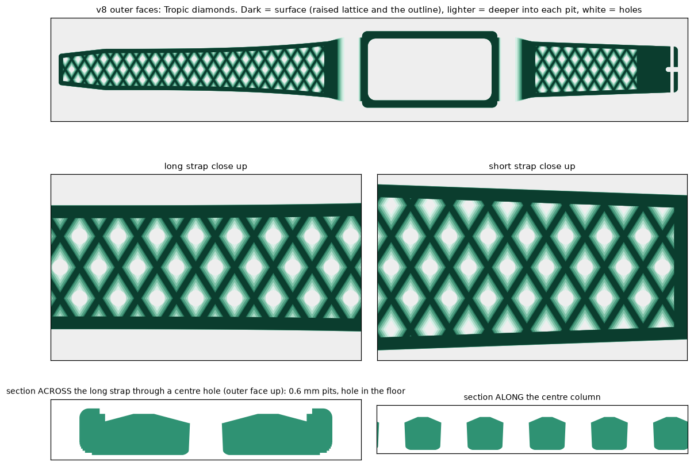
- **Breather holes** through the cup floor: 0.8 mm at the front-button recess (the deepest point of the mold, where the bare patch was) and 0.6 mm at seven points round the window lips, so every dead-end pocket has an exit. A bead of silicone weeps out of each under the cup; stand it on parchment and trim the beads.
- **Twice the lid vents:** ten over the jacket, one every 10 mm along each strap between the hole columns, plus the thick end and the tip.

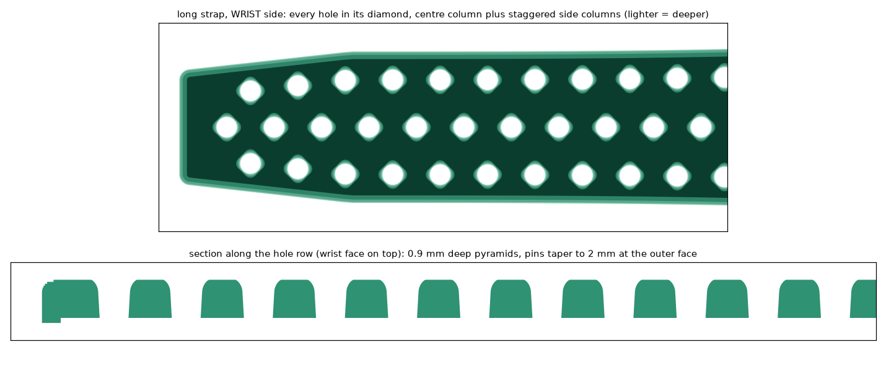

The holes do not vent the strap floors: the cup is 19 mm thick under the straps, so the pin sockets cannot reach outside. What stops strap craters is the print coat in the procedure below.

| File | What | Print |
|---|---|---|
| `stl/band_core.stl` | as v7 | PLA, 0.16 mm, supports on build plate only (under the port blade) |
| `stl/band_cup.stl` | v7 cup with the Tropic diamond bumps, 76 pin sockets and 8 breather holes | PLA, 0.2 mm, diagonal, brim; clear any breather hole that printed shut with a needle |
| `stl/band_lid.stl` | wrist face: fillet ridge, 76 chamfered hole pins, the two bosses over the pin, 37 vents | PLA, 0.2 mm, diagonal; set a minimum layer time of 8 s so the pins cool |
| `stl/band_pin_x3.stl`, `stl/keeper_mold.stl` | as v7 | PLA |
| `stl/band_preview_not_for_printing.stl` | the finished part | don't print |

**Casting, revised (Smooth-Sil 950, 100A : 10B):** release on everything. Core on the floor, pad down, blade down its relief, two M3 x 8. Pin across the short strap's end, shoulder against the wall. **Mix 45.5 g A + 4.5 g B**, pigment into A first; vacuum degas if you have a chamber. **Brush a thin coat of the mix over every surface the silicone will touch on the floor side** with a cheap flat brush: the whole cup floor, the button recess, both strap troughs and the panel steps, the thick end round the pin, and up to the core's pad edge. This is the step that stops the craters. Then pour the rest in a thin stream from height **at one end only**, so the front advances along the cup and pushes the air ahead of it, until it stands just above the rim. Tap the cup on the bench for a minute. **Leave it 10 to 15 minutes** so bubbles rise and pop at the open surface. Then the lid, one end first, pressed down onto the rim. Cure 18 h, or 6 h at 45 C. Demold as v7: lid, pin, screws, jacks; stretch the USB wall off the blade before lifting the core. Trim the vent nubs and the breather beads.

## Band v7 (`hardware/sleeve_v7/`)

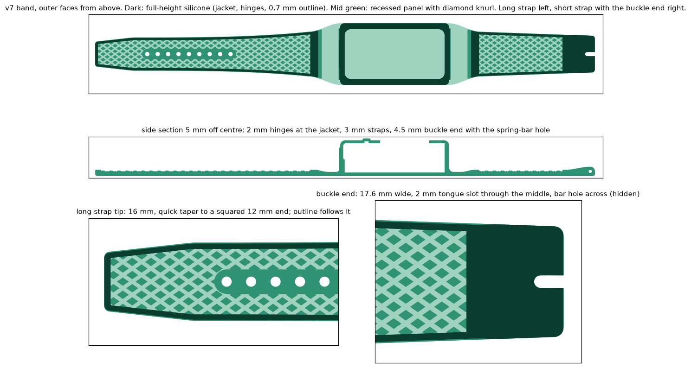

The v6 jacket with **Tropic-shaped straps and a real metal Tropic buckle**. Nothing printed stays in the band: no cast-in plate, no printed buckle or tongue (v6's printed lugs let the spring bar pop out). The buckle is 18 mm between its lugs and pivots on its own thin spring bar (21 mm tip to tip, about 1.4 mm body).

| | Short strap (70 mm) | Long strap (117.6 mm) |
|---|---|---|
| Width | 29.6 at the jacket, 21.5 after a 15 mm flare, straight taper to 17.6 at the end | 29.6, 21.5 after the flare, one eased taper to 16.0 that ends 18 mm before the tip, then 16 to 12 over the last 18 mm |
| Thickness | 2.0 hinge at the jacket, 3.0 strap, 4.5 at the buckle end (ramps over 12 mm) | 2.0 hinge, 3.0 strap |
| End | quarter-round over the bar, 1.5 mm plan corners | squared off, 1 mm plan corners |

- **Slow taper:** the long strap has to be 18 mm or narrower wherever it sits in the buckle, which starts 14 mm toward the jacket from the hole in use. A straight taper from 21.5 to 16 would still be 19.3 mm there, so the taper is one eased curve (exponent 3.09, computed from that constraint): 18.0 mm at 38.6 mm from the jacket, 16.0 to 16.9 at the holes.
- **Holes:** nine, round, 5 mm pitch, sizes 175 to 215 mm (the tongue sits at the short strap's end). 2.0 mm on the outer face for the 1.8 mm tongue tip. On the wrist face each hole sits at the bottom of a **shallow diamond pyramid**, Tropic style: 3.2 mm across its diagonals (one diagonal along the strap), 0.9 mm deep (the straight part of the hole is the remaining 1.75 mm), only at the nine holes, with 1.8 mm of full-thickness strap between neighbouring tips. The pyramid is smooth all over: its corners are rounded (no sharp valleys between faces), its rim rolls over from the wrist face, and its faces curve into the hole. The lid's pins stand on those pyramids and taper from 2.2 to 2.0 mm, which is also what keeps them from snapping on demolding. 25 mm of tail past the last hole.

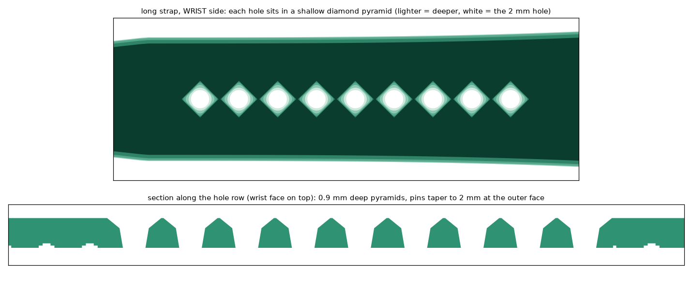

- **Buckle end:** the bar axis is 2.25 mm from the end and 2.25 mm above the wrist face, so 1.5 mm of silicone surrounds the hole on every side. The hole is cast by a **printed pin that drops in from the rim** (a 1.5 mm round rod with one small flat so it prints lying down; the hole has no corners for a tear to start from): its handle fills a 4 mm notch in one cup wall, flush with the rim, and ends in a wider grip outside the cup whose shoulder stops against the cup's outer wall, so the pin is fully in when the shoulder touches; the rod lies in a round-bottomed seat in the rib and in a matching notch in the far wall. A **2.0 mm slot through the full thickness**, from the end to 2.5 mm past the bar, lets the buckle's tongue sit on the bar and swing. Its former is split at the pin: a rib on the cup below it and a boss on the lid above it, so nothing has to be threaded through a hole. A second small boss on the lid fills the far wall's notch above the rod.

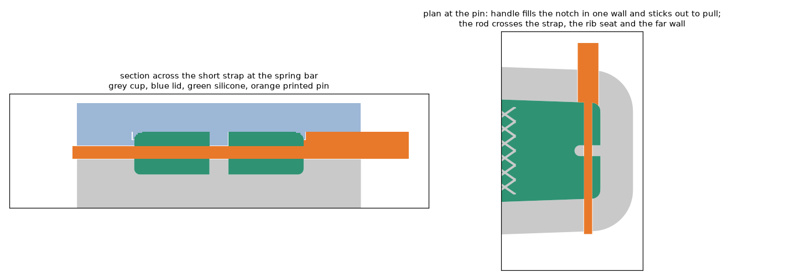 The extra thickness is on the outer face; the wrist face stays flat.
- **Outline and texture:** a panel inset 1.3 mm from the strap edge is recessed 0.35 mm, leaving a clean 0.7 mm raised outline (the outer-face edge radius is 0.6). The v6 diamond knurl is cut into the panel and runs to its edge, with a smooth lane round the holes. The panel starts past the hinge and stops where the buckle end thickens. Thinnest silicone under a groove: 2.25 mm.
- **Port border:** the slot in front of the USB-C port sits in a raised border, 0.5 mm proud of the end wall with rounded edges, 1.8 mm beyond the slot all round, so the silicone the plug pushes through is 2.0 mm thick instead of 1.5. The core's blade now ends flush with the border's face and touches the cup there. Because the core drops in from the rim, the same 0.5 mm relief has to run from the border to the rim, so the border continues toward the strap as a raised strip of the same width. There is no tab to cut off any more; at most a film over the slot's mouth to wipe away.

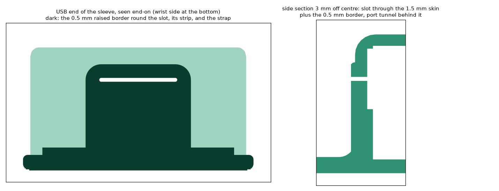

- **Window edge:** the core's window pad now touches the cup floor only on a 0.6 mm rim round its edge (the middle is relieved 0.3 mm). The screws press a line, which seals far better than a printed face, and any film that still gets under is thinnest at the window's edge and parts there.
- **Keepers:** two cast silicone rings, 19.5 x 6.2 mm inside, slipped over the short strap's end before the buckle goes on.

| File | What | Print |
|---|---|---|
| `stl/band_core.stl` | Stick shape, window pad with pinch-off rim, port tunnel and blade | PLA, as exported, 0.16 mm, 3 walls, supports on build plate only (under the port blade) |
| `stl/band_cup.stl` | one 252 x 43 mm open-top mold: panel plateaus and knurl ridges on the trough floors, lower tongue-slot rib with the pin's seat, two pin notches, hole-pin sockets | PLA, 0.2 mm, **diagonal** on the bed (fits a 191 mm square), brim, no supports |
| `stl/band_pin_x3.stl` | three pins (two spares): handle + 1.5 mm round rod, 35 mm long | PLA, 0.16 mm, as exported (rod on the bed), no supports. Check one drops into its notches before pouring |
| `stl/band_lid.stl` | wrist face: fillet ridge, nine hole pins on diamond pyramids, the two bosses that close over the pin, seventeen vents | PLA, diagonal, no supports |
| `stl/keeper_mold.stl` | two ring cavities | PLA, as exported |
| `stl/band_preview_not_for_printing.stl` | the finished part (18.7 cm3) | don't print |

**Casting (Smooth-Sil 950, 100A : 10B by weight):** release on everything. Core on the floor, pad down, port blade down its relief in the end wall, two M3 x 8 up through the cup. Lay the pin across the short strap's end: handle into the wide notch, rod into the rib's seat and the far wall's notch. **Mix 44 g A + 4.4 g B**, pigment into A first (the band is about 23 g; the rest is the keepers, the cup and the stick). Degas if you can. Syringe the lip layer, the front-button pocket and the thick end round the pin, then pour along the whole length to just above the rim, tap. Lid on, one end first; excess bleeds from the vents. Fill the keeper mold from the same mix. Cure 18 h, or about 6 h at 45 C (not hotter: the molds are PLA). **Demolding:** lid off, then pull the pin out sideways by its handle. M3 screws out, card down the jacket's long sides, M4 screws into the jack holes until the core and band rise. Peel the straps out, lift the top end of the core out of the window and slide it toward the top end. Trim the vent nubs and wipe any film off the port slot's mouth. **Buckle:** keepers on first; tongue into the slot, spring bar through the strap and the tongue's loop, tips into the buckle's lugs.

## Band v6 (`hardware/sleeve_v6/`)

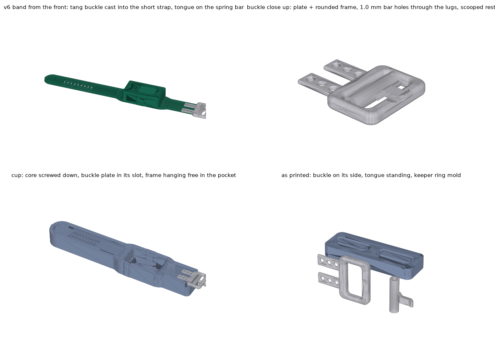

v5's band with a **classic tang buckle** in place of the peg, and 0.2 mm more silicone over the face and the back (lip 1.4, back 1.7 mm; 17.2 mm tall). Everything else is v5: same jacket, hinge, window, one open pour. The **port slot is cast, not cut**: a 0.5 x 10 mm blade with rounded ends on the core runs from inside the port tunnel through the 1.5 mm skin and 1 mm into a channel in the cup's end wall, so the band comes out with a 10 x 0.5 mm slot in front of the USB-C port that has no crack tips to spread from (a cut slit kept growing). The channel is open from the rim so the core drops in; it fills with a thin silicone tab above the slot, which is cut off flush. The nine holes sit 10 mm further toward the tail (sizes 160-200 instead of 150-190; v5 barely fitted a 165 wrist) and are **slots**, 3.4 x 5.8 mm with rounded ends, for the wider tongue.

**Buckle:** one PETG piece cast into the end of the short strap. A 5 x 4.5 mm plate closes the strap end, anchored by two 16 mm rounded tongues with three chamfered holes each, buried mid-thickness in the strap. From the plate grows a **rounded frame**: 3.2 x 4.5 mm rails and a 4.5 mm far bar, plan corners R3.5 outside and R2 inside, every edge rounded R1.5, so the section is nearly a wire and nothing is square. The lugs carry the **Tropic strap's 22 mm spring bar** (24.5 tip to tip, 2.5 body, 0.8 tips) in **1.0 mm holes straight through**, 22.6 mm apart, so the tips sit 0.95 mm deep and a pin pushes the bar out from outside. The far bar has a scooped, tapered rest for the tongue. No keeper on the buckle, no lips, no pins, nothing sticks out. The **tongue** is a second print: a full-width sleeve (3.0 mm bore for the 2.5 mm bar, 1.3 mm wall, 22.2 long) that hides the bar and centres the arm, and a **4.5 x 2.2 mm arm** (3.5 at the tip) that rests in a broad shallow dish on the far bar with 0.3 mm clearance and turns up 1.2 mm at the tip; wide so it cannot snap. Bar centre 2.6 mm above the wrist face, so the sleeve sits flush with the wrist. The **keeper is a cast silicone ring** (22.2 x 5.6 inside, 2 mm section, 5 mm wide) from its own two-cavity mold: it stretches over the buckle onto the short strap and the tail tucks through it, like any watch.

**Texture:** the straps' outer faces carry a diamond knurl: two families of grooves at 35 degrees to the strap, 2.2 mm apart, 0.4 mm deep and 0.8 mm wide at the surface, tapered in two steps. They are ridges on the cup's trough floor (two layers at 0.2 mm). The pattern stops 2 mm from the strap edges and the round tip, leaves a smooth lane 1.5 mm around the slot row so no groove ends at a slot, starts past the thin hinge, and stays off the buried anchors (only 0.6 mm of silicone covers them). Set `texture = false` for plain straps.

**Wear:** long strap under the far bar, tongue out through a slot, tail over the sleeve and the plate, along the short strap and through the keeper. Sizes 160-200 mm in 5 mm steps.

**Mold:** the plate sits in a slot flush with the strap end with a 1.5 mm wall in front of it between the rail-root fillets; the frame hangs in an open pocket touching nothing, so demolding never loads it. The lid's 0.2 mm step presses the plate onto its seat; the ridge that rounds the wrist edge stops short of the plate. Thirteen vents (six over the jacket, seven along the straps) instead of five.

| File | What | Print |
|---|---|---|
| `stl/band_buckle.stl` | plate + anchors + tang frame, one piece | **PETG**, as exported (on its side: bar holes vertical, one rail on the bed, the other bridges 11 mm), 0.16 mm, **250-255 C, fan 10-20%, outer walls 30 mm/s**, Arachne walls with min wall width 50%, 100% solid, brim, supports on **build plate only** (they land under the two anchors and nowhere else) |
| `stl/band_tongue.stl` | sleeve + arm | PETG, as exported (sleeve standing, so the bore is round), same settings, supports on build plate only (under the arm) |
| `stl/keeper_mold.stl` | two ring cavities, 5 mm deep | PLA, as exported, no supports |
| `stl/fixed_tongue_temp.stl` | stand-in for the pivoting tongue when the spring bar is lost: a block that drops into the frame against the plate, a saddle on the plate and rail tops, and a short hooked tongue that stops 2.5 mm short of the far bar. Locked by one ~0.9 mm wire (a straightened paperclip) through lug, block and lug, ends bent over | PETG, as exported (standing, wire hole vertical), supports on build plate only, brim |
| `stl/band_core.stl` | Stick shape + window pad + port tunnel + port blade | PLA, as exported, 0.16 mm, 3 walls, **supports on, build plate only** (under the 0.5 mm blade that sticks out of the USB-C end) |
| `stl/band_cup.stl` | one 230 x 43 mm open-top mold | PLA, **placed diagonally** on the bed, brim, no supports |
| `stl/band_lid.stl` | wrist face: fillet ridge, clamp step over the plate, nine slot pins, thirteen vents | PLA, diagonally, no supports |
| `stl/band_preview_not_for_printing.stl` | the finished part | don't print |

**Casting:** release on the PLA only. Core on the floor, pad down, two M3 x 8 up through the cup. Buckle into its seat at the short end: plate dropped into its slot, anchors pointing back along the trough, frame hanging free in the pocket. **Mix 44 g A + 4.4 g B of Smooth-Sil 950** (100:10 by weight, 45 min pot life, 18 h cure; 950 tears 30% harder than the 945 used up to v5, which was 1:1, 22 g + 22 g) with pigment. Syringe the lip layer, the front-button pocket and the strap end around the anchors, then pour along the whole length to just above the rim, tap. Lid on, one end first, press onto the rim; excess bleeds from the vents. Fill the keeper mold from the same mix with the syringe and scrape it flush. Cure 24 h or 6 h at 45 C. **Demolding:** cut the flash round the lid, lever it off. M3 screws out, card down the jacket's long sides, M4 screws into the jack holes until the core and band rise. Peel the straps out, lift the top end of the core out of the window and slide it toward the top end so the port blade draws out of its slot. Trim the vent nubs, punch any hole skins, and cut the thin silicone tab off the USB-C end flush with the wall. Pull the keeper rings out of their mold with a pick. **Assembly:** keeper over the buckle onto the short strap first. Sleeve onto the spring bar, compress the bar, tips into the two lug holes; the arm points at the far bar.

## Band v5 (`hardware/sleeve_v5/`)

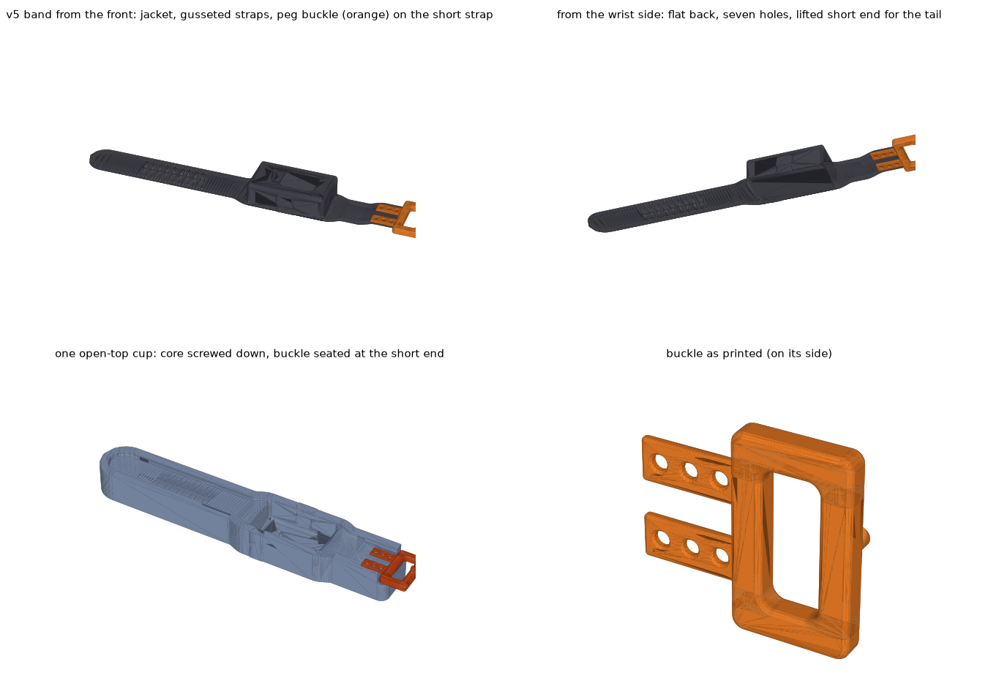

The Fitbit-style answer: **band and jacket are one silicone part**, cast in one open pour. The jacket is v4's sealed pocket (1.5 mm back, 1.2 mm lip, pocket at the Stick's nominal size, port slit, button pads) with pebble styling (R2 plan corners, R2.5 round on the front perimeter, 0.8 round on the wrist edge). The **window matches the screen** plus 1.5 mm, so only the display shows and the lips over the Stick's ends are 7 mm (top) and 17 mm (USB-C end): the first cast had a 2 mm top lip and the Stick popped out when the band was tightened. The straps grow straight out of the end walls as a **hinge**: full 29 mm wide but only 2.0 mm thick for the first 6 mm, blending up to 2.8 by 12 mm, with an R2 fillet up the end wall and the root starting inside the jacket so there is no crevice at the sides. The jacket is nearly as long as the flat of the wrist, so the band has to bend right at the sleeve; a thin wide hinge does that at a few percent strain instead of levering the end wall. The long strap's tip is a full semicircle. No frame, no lugs, no loops: the band pulls on the jacket the way v1's did, through ten times the rubber. 16.1 mm tall, 17.0 at the button.

**Closure:** a one-piece PETG peg buckle cast into the end of the short strap. A 5 mm plate closes the strap end (its outer face shows); two 16 mm tongues, fully rounded with three chamfered holes each, anchor it mid-thickness in the strap; two 5 x 4.5 mm rails, R2 fillets at their roots and R2 outside corners, edges rounded 1 mm, carry a 5 mm crossbar that closes the frame. The **peg hangs from the underside of the plate**, centred: the long strap runs under the plate, and the short strap's tension clamps it there, so the wrist's curvature cannot lift it off (a peg at the far end of the rigid frame did lift off). 3.0 mm neck, 2.5 mm past the strap's wrist face, with a one-sided 0.9 mm bump just below the strap that the 3.4 mm hole snaps over. The lid has a pocket for it. In the mold the plate sits in a slot with a wall behind it only between the rails; the rails, crossbar and peg sit in an open pocket touching nothing, so no flash can grip them and demolding puts no load on the frame (the first, lighter frame snapped at its rail roots because flash had locked the rails in slots). To fasten: the long strap goes **under** the whole buckle from its far end (nothing goes through the frame's opening), on under the short strap, then you press the plate down onto it so the peg snaps into one of nine cast holes (5 mm pitch, sizes 150-190 mm), and the tail tucks under the short strap, whose last 12 mm are lifted 3 mm to let it through.

| File | What | Print |
|---|---|---|
| `stl/band_buckle.stl` | one-piece peg buckle | **PETG**, as exported (on its side, so the peg is strong in bending), 100% infill, 0.16 mm, **250-255 C, fan 10-20%, outer walls 30 mm/s**, supports on for the two tongue edges (threshold 60 deg keeps them off the peg) |
| `stl/band_frame_salvage.stl` | a slip-on frame for the first cast, whose buckle snapped: slides over the remnant plate, pinned with a spring bar after drilling 1.7 mm through its holes | PETG, as exported, no supports |
| `stl/band_core.stl` | Stick shape + window pad + port pocket | PLA, as exported, no supports, 3 walls |
| `stl/band_cup.stl` | one 210 x 42 mm open-top mold: jacket pocket, strap troughs, buckle seat, M3 clamp and M4 jack holes, hole-pin recesses | PLA, **placed diagonally** on the bed, brim, no supports, 0.16 mm |
| `stl/band_lid.stl` | forms the wrist face: fillet ridge, the boss that lifts the short strap's end, nine pins for the holes, vents | PLA, diagonally, no supports |
| `stl/band_preview_not_for_printing.stl` | the finished part | don't print |

**Tang buckle option (`buckle_adapter.scad` → `stl/buckle_tang_22mm.stl`):** a printed watch-style buckle that caps the cast-in plate after the frame's rails and crossbar are cut off flush. Sized for the 22 mm band (22.6 mm inner width), pivot = the Tropic strap's 22 mm spring bar (24.5 tip to tip, 2.5 body) seated in the rails 23.1 mm apart, tongue printed (`stl/buckle_tongue.stl`, flat, no supports), fixed keeper bridge behind the cap. Slide over the plate, CA glue, optional 1.6 mm pins through the side holes. Worn like a watch: long strap under the far bar, up through the opening, tongue out through a hole, tail over the pivot bar and under the keeper. Set `tongue_len` to the Tropic tongue's loop-centre-to-tip length and the plate dimensions to the band's before printing. PETG on its side, supports on.

**Casting:** release on everything. Core on the floor, pad down, two M3 x 8 up through the cup. Buckle into its seat at the short end: peg up, tongues pointing back along the trough, plate dropped into its slot; dry, no release on it. **Mix 22 g A + 22 g B** with pigment (cast volume 17.6 cm3, about 21 g). Syringe the lip layer and the front-button pocket, then pour along the whole length to just above the rim, tap. Lid on, one end first, press onto the rim; excess bleeds from the vents. Cure 24 h or 6 h at 45 C. **Demolding:** cut the flash round the lid, lever it off (the boss and pins pull out of the strap). M3 screws out, card down the jacket's long sides, M4 screws into the jack holes until the core and band rise. Peel the straps out, slide the core out through the window, punch any skin left in the holes, cut the port slit.

## Sleeve v4 (`hardware/sleeve_v4/`)

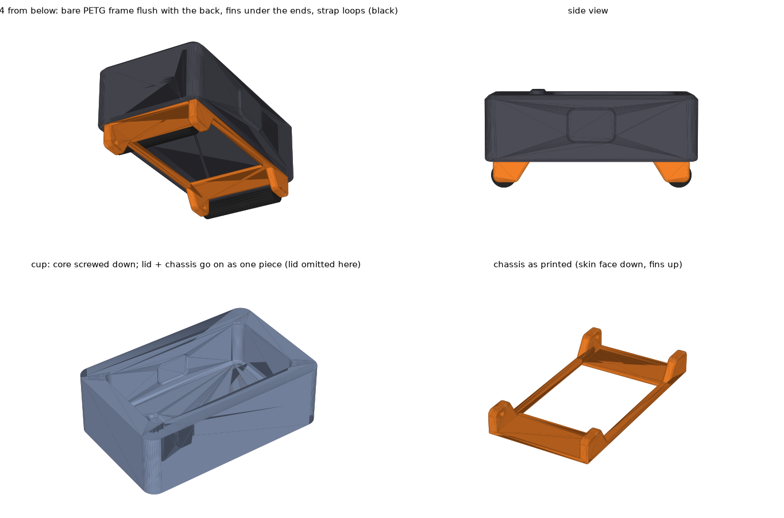

v3 with the PETG frame moved **outside** the silicone: the two end brackets and two side rails sit flush in the back surface with their faces bare, like a watch caseback, and the fins grow straight off the brackets. The back is 1.5 mm (1.0 frame + 0.5 silicone skin under the Stick, so the pocket stays sealed and no PETG touches the Stick or passes through silicone), the lip over the face is 0.8. **52.4 x 29.6 x 16.8 mm, 17.7 at the front button**, against 17.2 / 18.1 for v3 and roughly 17 for the band. Frame edges on the silicone side are rounded (0.4 mm); the exposed faces have clean square perimeters so the silicone meets a vertical wall, not a feather edge.

No rim posts or tabs: the **lid locates the frame**. Four slots in the lid are 0.1 mm narrower than the fins; the lid is pushed onto the fins dry until the frame's back is flat against it, and lid + frame go onto the poured cup as one piece. Wherever the lid touched PETG the face comes out bare, so there is no film to wear through. The lid also carries the fillet ridge that rounds the back edge (cup rim straight, with a rebate), and the cup floor has two M4 jack holes for demolding.

| File | What | Print |
|---|---|---|
| `stl/sleeve_chassis.stl` | frame (2 brackets, 2 rails) + 4 fins | **PETG**, as exported (skin-side face on the bed, fins up), brim, no supports, 100% infill. Check the 1.0 mm bar holes with a spring bar tip |
| `stl/sleeve_core.stl` | Stick shape + 0.8 mm window pad + port pocket | PLA, as exported, no supports, 3 walls |
| `stl/sleeve_cup.stl` | open-top mold, straight rim with rebate, M3 clamp holes, M4 jack holes | PLA, as exported, no supports, 0.16 mm |
| `stl/sleeve_lid.stl` | lid with fillet ridge, press-fit fin slots and two vents | PLA, as exported (flat, ridge up), no supports. If a slot is too tight, sand the fin, not the slot |
| `stl/sleeve_preview_not_for_printing.stl` | the finished silicone | don't print |

**Casting:** release on everything. Core on the floor, pad down, two M3 x 8 up through the cup. Push the lid onto the chassis fins until the frame's back is flat on the lid's underside. **Mix 12 g A + 12 g B** with pigment (cast volume is 7.7 cm3). Syringe the lip layer and the front-button pocket first, pour to about 1 mm above the rim, tap. Lower lid + frame together, one end first so air escapes from under the brackets, press onto the rim; excess bleeds from the vents and slots. Cure 24 h or 6 h at 45 C. **Demolding:** cut the flash round the lid's edge with a blade and lever a corner; the lid lifts off and the frame stays in the sleeve. M3 screws out, card down the long sides, then two M4 screws into the jack holes turned alternately until the core and sleeve rise out. Peel the short-lip end off the core, slide the core out through the window, cut the port slit (12 mm, horizontal, centred on the USB-C end wall where it dents under a fingernail).

## Sleeve v3 (`hardware/sleeve_v3/`)

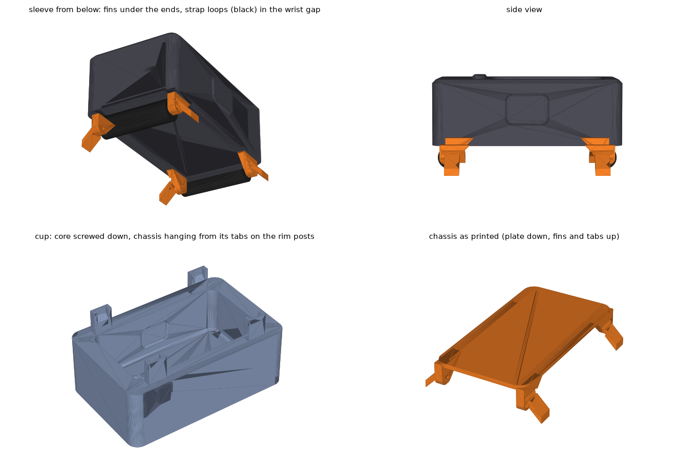

Same sealed jacket as v2, but the strap lugs are **under the ends instead of past them**, so the sleeve is 51.8 x 29.0 x 17.2 mm (+0.9 button bump) against v2's 65.4 x 28.6 x 18.3 and the band's roughly 16 over the wrist, with a 0.8 mm round on the back edge. The round is formed by a fillet ridge on the **lid**, never by an undercut in the cup: the first cast used a rim lip and the sleeve had to be cut out of the mold. The cup's rim is straight, with a 0.9 mm rebate the ridge sits in. A PETG **chassis frame** with every edge rounded (0.4 mm radius, so nothing sharp bears on the silicone) is buried in the 2.4 mm back layer: two 1.2 mm end brackets under the ends of the Stick, joined by two 1.0 x 2.2 mm rails along the sides under the pocket's edge. The rails carry the strap tension (about 20 kgf) but bend easily, so the middle of the back is plain silicone and the sleeve still flexes to get the Stick in and out (a full plate, tried first, made that hard). 0.4 mm of silicone sits between the brackets and the Stick, 0.8 mm between them and the wrist. The lip over the face is 1.0 mm: it retains and seals, and it is what sets the height. Four **fins** grow down from the brackets inside the sleeve's footprint, 2.2 mm thick with 1.6 mm of silicone outside them, and protrude 5.1 mm below the back. The 22 mm spring bar spans each pair (21.4 mm gap, 1.0 mm blind holes), so the strap end wraps a bar 3.5 mm under the sleeve's end, in the gap a straight sleeve leaves over a curved wrist. Strap tension goes into the plate, not the silicone. Nothing is closer than 0.5 mm to a surface and the only PETG you see is the fins.

The chassis hangs in the mold from four **tabs that rest on posts on the cup rim**, entirely above the pour, so nothing gets cut near silicone: the tabs sit on 45-degree seats and slide outward until their tips meet a stop wall, which centres the chassis and sets its height. Twist them off at their 0.6 mm necks afterwards.

| File | What | Print |
|---|---|---|
| `stl/sleeve_chassis.stl` | frame (2 brackets, 2 rails) + 4 fins + 4 tabs | **PETG**, as exported (plate on the bed), brim, no supports, 100% infill, 245-250 C, fan 20-30%. Check the 1.0 mm bar holes with a spring bar tip; open with a 1 mm bit if needed |
| `stl/sleeve_core.stl` | Stick shape + window pad + port pocket | PLA, as exported (back face down), no supports, 3 walls; the port pocket is only 0.7 mm proud so it prints without support |
| `stl/sleeve_cup.stl` | open-top mold, straight rim with a rebate for the lid ridge, four rim posts, two M3 clamp holes and two M4 jack holes in the floor | PLA, as exported (open top up), no supports, 0.16 mm |
| `stl/sleeve_lid.stl` | lid with the fillet ridge that rounds the back edge, and openings for the fins, tabs and posts. Use it; without it the back edge is square | PLA, as exported, no supports |
| `stl/sleeve_preview_not_for_printing.stl` | the finished silicone | don't print |

**Casting** (open pour, window face down, same as v2): release on everything. Core on the floor, pad down, two M3 x 8 screws up through the cup's underside. **Mix 17 g A + 17 g B** with pigment. Syringe the lip layer and the front-button pocket first, then pour until the core's back is under about a millimetre of silicone. Lower the chassis in, fins up, one end first so the air runs out from under the plate, until the tabs land on the posts; press gently until the tab tips touch the stop walls. Top up to just above the rim, tap, then press the sprayed lid on (its ridge forms the rounded back edge; excess comes out of the openings). Cure 24 h, or about 6 h with the cup on the printer bed at 45 C: the preheat menu times out after ~10 min, so send `tools/bedhold_45c_ff.gcode` as a print job instead (it only holds the bed, no motion; stop the job to end it early). **Demolding:** cut the flash round the lid's edge with a blade and lever a corner; it lifts straight off the fins. M3 screws out. Slide a card down both long sides to the floor to break the vacuum. Then two **M4 screws into the jack holes** in the floor (the two plain holes between the M3 recesses), turned alternately a couple of turns at a time: they tap the PLA and push the core's pad, and the core lifts the sleeve out. Never pry against the silicone edge or pull on the tabs. Peel the short-lip end off the core, slide the core out through the window. Small tears from a bad demold can be glued with Sil-Poxy (not superglue, not fresh 945); glued tears in a lip will reopen eventually, tears in the back or walls hold. Twist the tabs off and shave the stubs with a blade flat on the fin. Cut the port slit: 12 mm, horizontal, centred on the USB-C end wall, where it dents under a fingernail; the wall is 1.5 mm there and 2.2 mm at the slit ends.

**Strap:** spring bars into the fin holes from between the fins. The strap end sits under the sleeve's end and leaves downward.

`hardware/sleeve/` is the earlier design: a thinner sleeve with a PETG lug frame cast into its back. Kept with its STLs for reference.
